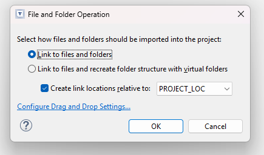

# Spark Blinky Project

1. [Project Details](#project-details)
2. [LED Processor Structure](#led-processor-structure)
3. [LED Lib Structure](#led-lib-structure)
4. [IDE Setup](#ide-setup)
5. [Importing Project](#import-project)
6. [Project Structure](#project-structure)
7. [Future Improvements](#future-improvements)

## Project Details
For any project I develop, design, or architect, the first assumption is that it must be reusable.  So, I will always work to make something that is portable.  Any _processing_ code that is written, should be done in a way that is agnostic to a specific MCU, giving the code the flexibility to be moved to different MCUs, RTOSes, or SDKs.

I find the best way to do that, is to create a processor that uses generic, non-SDK specific API calls, and kept strictly within the confines of C libraries.  So, I generally follow a paradigm of creating a struct that contains pointers to function calls whenever an interaction with an API or SDK that is specific to an MCU.  I will also try and keep that number of functions to a minimum.  For example, within this project, turn_led_on() and turn_led_off() both interact with SDK by calling on led_set_polarity() and passing in a state to be ON or OFF.  Then, on the application side, it writes to the GPIO API to set LED output.  This limits the applicaiton function to one, while allowing the LED library multiple different variations of LED state changes.

Part of the project structure is to also have the application code for the LED library separate from the rest of the "main" application code.  This keeps the main loop and app.c clean and readable.  As a project grows, each specific peripheral will get its own library, its own driver, and its own place within the project structure.

Another design paradigm that I make sure to use in a project such as this, is the use of Interrupts.  This allows the main loop to continue to do other processing, while the interrupt can handle library or peripheral specific code.  As a general rule, an Interrupt routine should be kept as short as possible, such as setting a flag.  In this particular project, toggling the LEDs is a fast enough process to keep within the Interrupt Service Routine, to be able to cleanly separate the LED interactions from any other processing or actions that might take place in the main loop.

Overall, the project structure allows for:
- portability
- separation from processes
- use within several different OSes
- clean, readable code

The remaining of the README is further explanation on LED processor and library, and how to import and build the project, as well as any issues or bugs that I found along the way.

## LED Processor Structure
This is an LED library intended for Generic MCU agnostic processing of LEDs, LED states, and other processing.  It contains public functions that can be called from anywhere within the application, so long as the led_proc.h is included, and the led_proc_t is properly setup and intialized.  The most critical parts of the led_proc are the led_proc_t and the led_t structures.  The two structs are further explained below, although are also documented within the led_proc.h file, as are each of the function calls available.

### led_proc_t
Documentation is provided within the led_proc.h on the purpose of part of the structure.  This is a structure that is maintained by the application, and is always passed in to the led_proc function calls to provide a reference to the MCU, SDK, and application specific HAL libraries; and allows the led_proc library to be completely portable.
```
typedef struct led_proc_t {
	led_proc_error_type (*led_init)(led_t*);
	led_proc_error_type (*led_set_polarity)(led_t*, led_output_state_t);
	led_proc_error_type (*led_set_duty_cycle)(led_t*, int);
	led_proc_error_type (*led_get_state)(led_t*, int*);
	led_proc_error_type (*led_deinit)(led_t*);
	led_t *led_array;
	void *led_typedef;
}led_proc_t;
```

### led_t
The led_t structure allows the led_proc to remain generic.  The led_t struct is used and passed wtihin the library in order to keep the MCU and SDK specific GPIO Typedef completely removed from the actual processing.  The only requirement is for the user to update the typedef of the led_ptr.  A warning is generated during compilation to remind the user to update this in the led_proc.h file.
```
#warning "User Must Change GPIO_PinTypeDef to correct SDK GPIO Typedef"
typedef struct LED {
	GPIO_PinTypeDef led_ptr;
	led_type_t led_type;
	union led_state_t led_state;
	int led_pwm_hertz;
}led_t;
```

## LED Lib Structure
The led_lib is where the led_proc_t is initialized and maintained, and contains the functions required tying the led_proc to the TLS8258 SDK, and additionally contains the user code for generating the blinky and pulsing LEDs.

### Timer0
In the init_led_lib, Timer0 is initialized and started to generate an interrupt every 500ms.  It is within the interrupt that LED output states are modified.  This allows the user to not have to call on a thread or processor sleep and continue to use the while loop to do other processing.

### Timer1
A second timer is initialized and started which continually updates a user readable register.  This is used in the user code while loop, to check _if_ a certain time period has passed, and update the PWM Duty Cycle of the White LED.  This is intended to provide proof that the processing of the LED outputs from Timer0 can be separately processed by Timer1 within the while loop.

### Bug Fixes and Workarounds
It was required to add in a workaround for a bug in the SDK with the read_gpio function.  At least for outputs, the read_gpio(pin) always returned a 0 regardless of the actual state of the output pin.  This required the application code to always know and maintain the state of each output pin to make sure the led_proc functioned properly.


## IDE and SDK Setup
This project was developed and built in [Telink IoT Studio v2025.02](https://wiki.telink-semi.cn/wiki/IDE-and-Tools/Telink_IoT_Studio/).  Telink IoT Studio is required for compiling and building.

After downloading and installing the IDE but before running Telink IoT Studio, the [SDK](https://wiki.telink-semi.cn/wiki/chip-series/TLSR825x-Series/#software-development-kit} also must be downloaded.  This project was built on the [tc_platform_sdk v3.3.0](https://github.com/telink-semi/tc_platform_sdk/releases/tag/V3.3.0).  The source code of which can be downloaded by scrolling down tot he bottom of the SDK GitHub repository release page and clicking on the Source Code Zip File.


Once the SDK download has completed, extract the zip file into a document folder that will serve as a workspace.  It is now time to open Telink IoT Studio.  When it opens,  an alert will popup asking for a workspace location.  Click the Browse button and navigate to the SDK that was extracted.


You will now be taken to the opening window with a workspace explorer and can import the SDK.  First, click on "Import projects..." button.


Clicking the import projects button will bring up an alert with a selection box.  Select "Existing Projects into Workspace" then click Next.


In the next Window of the Import Projects Alert Dialog, click on Browse and navigate to SDK Location->project->tlsr_tc32.  This will populate Projects with 5 potential projects.  These are all of the separate SDKs available.  The correct SDK for the TLS8258 is the B85 SDK.  Click Deselect All, then select ONLY the B85_Driver_Demo project.  Finally, click Finish, and the project along with all of the Demo applications will be loaded into the Project Explorer.  The IDE and SDK are now setup and ready for development.


## Importing and Building Project
Importing the project in a safe and reliable way is critical to a successful build.  To correctly import the project, first download the source code zip file for this project in the Release page, then extract the files and rename the folder.  To follow the example in this README, name the folder
```
spark_tls8258_blinky_rm
```

Next, copy and paste the folder into the SDK vendor folder in the SDK Location->demo->vendor.


Next, drag and drop the folder into the vendor folder in the Project Explorer window pane of Telink IoT Studio.  The IDEO will give an alert with a question about how to import and link the files.  Make sure that the following options are selected and press OK.


The application will now appear in the vendor list.


Next step is to make sure we have a build configuration.  Right click on the B85_Driver_Demo project folder at the top of the Project Explorer.


In the Project Properties Alert Dialog, go to the ">C/C++ Build" to be able to Manage Build Configurations.


Click on the "Manage Configurations..." button.  Click on "New..." then follow the settings displayed in the screenshot.  Make sure that the name of the new configuration matches the name of the folder that was imported.  Following the example of this README,the new configuration should be called:
```
spark_tls8258_blinky_rm
```


Click OK, and the new Build Configuration will now appear in the list.


Now, select the correct build configuration.  Once selected, a project will start a build.


The project is now succesfully imported and built.

### Building Project
To do more builds, make sure the correct Build Configuration is selected, and click the Hammer Icon.

### Potential Bugs while Building Project
There are a few potential bugs that may appear during the build that are relatively easy to work around.

#### Cygwin Error
Often times, the IDE will run out of Heapspace during the build.  This especially happens when building the entire project as opposed to just building a recently edited file.  The error will look something like:


To get a complete build, click the Hammer Icon again, and if the error occurs again, continue clicking the Hammer Icon until the build completes.  Each build continues to compile separate files until all of them have been compiled and linked together.

#### Multiple IRQ Definitions
Occassionally, during the build process, it will include other applications in the build.  This happens in particular if multiple applications have been built previously.  First, try doing a project clean by right clicking the B85_Driver_Demo and clicking on Clean Project, then try to build again.  If that still produces the error, the best workaround I have found for this so far is to remove the folder of other active applications that had been previously and succesfully built.  Be sure when removing, that you only remove from Workspace, and _do not delete_ from disk.


## Project Structure
The general project structure follows the paradigm set out by Telink in their wiki.  This has a project folder, within the vendor folder of the SDK to ensure proper linking to all drivers.


### main.c
The file main.c is not meant to be edited, but is designed to call on the PLATFORM_INIT and user_init.  Where the platform init is to initialize clocks, drivers, and peripherals; and the user_init is in the app.c file and intended for initializations specific to the application.  Finally main_loop is called which is the user application loop in app.c.


### app.c
In order to be able to build more upon the project, the app.c is kept very clean and empty.  Rather than doing initializations and application in the app file, the LED library has been separated, with its own forever while loop.  This allows more drivers to be developed and added into the application.  Ther user_init calls on the init of the LED library, and the main_loop calls on the run_led_loop.  Although the application, as is, keeps the loop in the LED library, this can be easily modified to call on the LED library functions after initial setup.

### app_config.h
The app_config has the application configurations including system clocks speeds.  In other applications within the TLS8258 environment, GPIOs are also defined here.

### bsp.h
This is the Board Support Package header file, which includes minimal setup and definitions of peripherals on the Board, such as LEDs and Buttons.  This project, however, only contains LEDs.

### lib
The lib folder contains the LED Library.


## Future Improvements
### More PWM Support
The SDK for the Telink requires a PWM_ID that should be stored within the led_t structure.

### Possible Addition of GPIO Functions to led_t
It may be possible to reduce the number of functions maintained by the user library, by including references to the HAL SDK GPIO function calls within the led_t to handle the state changes.  This could possibly remove the need for all of the led_proc_t functions with exception to the initialization, or may only require the led_t struct.  Although, it is prefered having the ability to have some amount of logic on the application side to deal with potential SDK bugs, such as the read_gpio bug.

